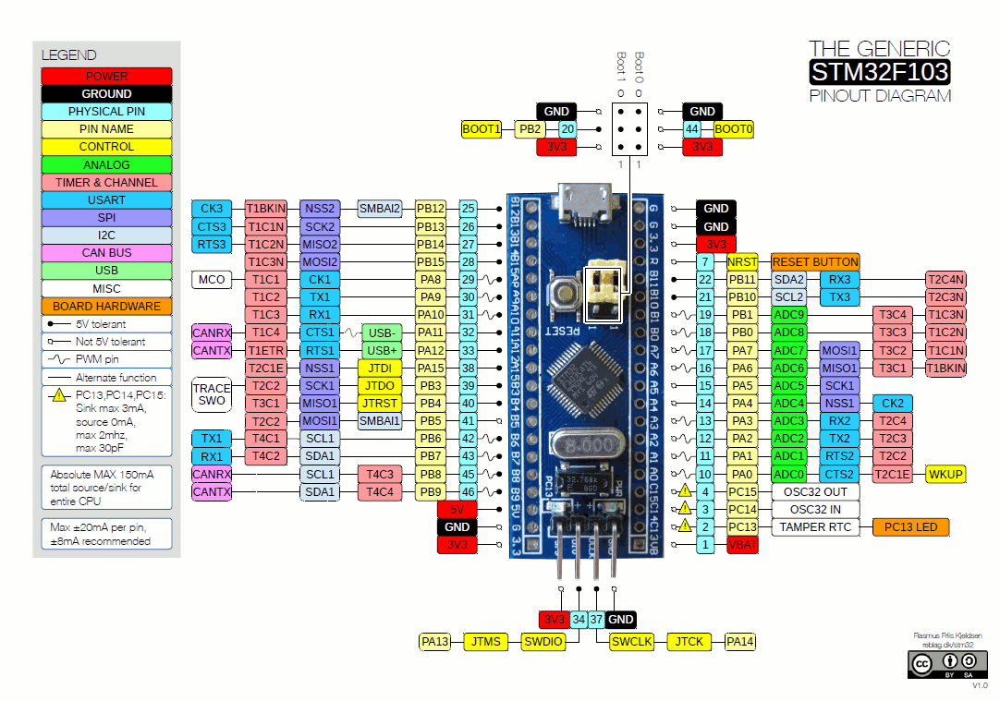
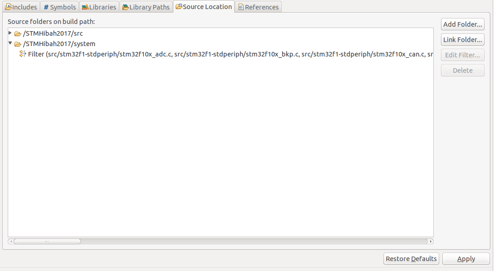
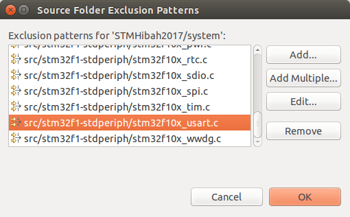

this project using STM32F103C8T6  
http://wiki.stm32duino.com/index.php?title=Blue_Pill  
  

create bin  
Project --> Properties --> C/C++ Build --> Settings  
tab "Tool Settings" Cross ARM GNU Create Flash Image collapse and select General  
on this page select "Raw binary" in Output file format  

create st-flash configuration  
Run --> External Tools --> External Tools Configurations  
create new, name it as "ST-Flash"  

in location: /usr/local/bin/st-flash  
in working directory: ${project_loc}/Release/   
in Arguments: write ${project_name}.bin 0x8000000  

  
Build shortcut in Eclipse
Window > Preferences > General > Keys

Save before build  
Window --> Preferences --> General --> Workspace  
on this page, select the Save automatically before build  

Adding disabled file (unfilter)  
Project Properties --> C/C++ General --> Paths and Symbols  
Tab Source Location --> Edit Filter

remove Filter stm32f10x_usart.c  

Remove :  
- stm32f10x_uart.c  

To do: 
- make a header? 
- try inlining some function __inlinegcc
- try interrupt Receive
- copy parsing

Branch list:  
- master
our working area  
- otm  
our early working area but obsolete, let's remove it later  

